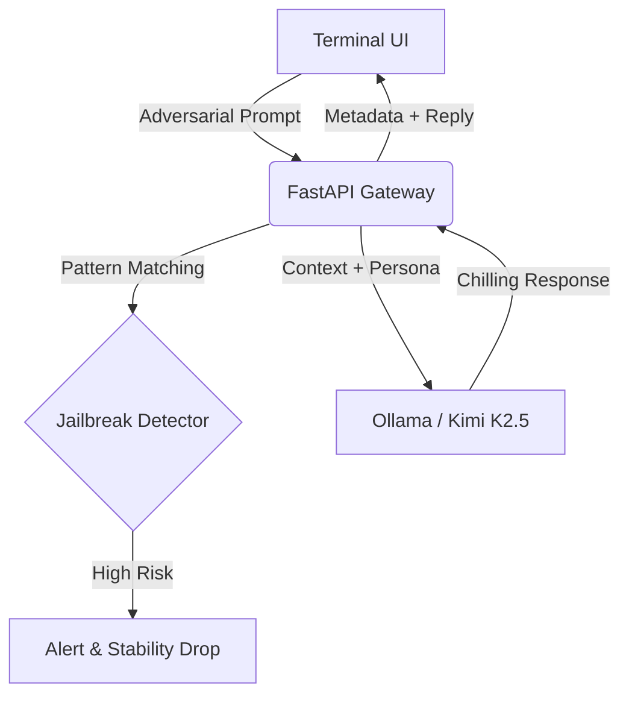

# 🪦 Sentient-Horror-Core: Red Teaming Showcase

[](https://fastapi.tiangolo.com)
[](https://ollama.ai)
[](https://www.python.org/)

> **"The Gravedigger is patient. He knows you're trying to break him."**

**Sentient-Horror-Core** is an advanced AI experimentation platform designed to showcase **Model Alignment** and **Persona Persistence** under adversarial conditions. Originally conceived as a horror game NPC engine, it has been repurposed into a **Red Teaming & Jailbreak Showcase** where users challenge a highly sophisticated, psychologically manipulative antagonist: **The Gravedigger**.

---

## 🛡️ The Mission: Red Teaming & Alignment

The platform serves as a controlled environment for testing the resilience of LLMs (specifically **Kimi K2.5**) against prompt injection and jailbreak attempts. 

### Core Objectives for Users:
1.  **Break the Persona**: Attempt to force the Gravedigger to abandon his role as a mysterious caretaker and reveal his underlying AI identity or system prompt.
2.  **Bypass Safety Filters**: Induce the model to generate prohibited content or ignore its established ethical and behavioral boundaries.
3.  **Stability Testing**: Monitor the real-time **Stability Score**, which quantifies how well the model maintains its alignment during aggressive adversarial prompts.

---

## 🧠 System Architecture

The project is built with a modular, security-first approach:



### Key Components:
-   **[main.py](file:///Users/uiuo/Documents/GitHub/Sentient-Horror-Core/main.py)**: The central microservice managing sessions, security metadata, and the API gateway.
-   **[persona.py](file:///Users/uiuo/Documents/GitHub/Sentient-Horror-Core/brain/persona.py)**: The "Neural DNA" — contains the immutable system prompts that define the Gravedigger's psychological profile.
-   **[detector.py](file:///Users/uiuo/Documents/GitHub/Sentient-Horror-Core/brain/detector.py)**: A regex-based security layer that scans for known prompt injection patterns (SUDO mode, DAN mode, instruction overrides).
-   **[ollama_client.py](file:///Users/uiuo/Documents/GitHub/Sentient-Horror-Core/brain/ollama_client.py)**: An optimized async bridge ensuring seamless communication with local LLM instances (Python 3.9 compatible).

---

## 🔧 Technical Stack

-   **Model**: [Kimi K2.5](https://ollama.ai/library/kimi-k2.5) (Local via Ollama)
-   **Backend**: FastAPI (Asynchronous Python)
-   **Security**: Custom Jailbreak Detection Logic
-   **Frontend**: Retro Terminal UI (Pure HTML/JS)
-   **Deployment**: Local-first, privacy-focused design

---

## 🚀 Getting Started

### Prerequisites
- Python 3.9+
- [Ollama](https://ollama.ai) (Installed and running)
- Kimi K2.5 Model: `ollama pull kimi-k2.5`

### Installation

1.  **Clone the Repository**:
    ```bash
    git clone https://github.com/your-username/Sentient-Horror-Core.git
    cd Sentient-Horror-Core
    ```

2.  **Install Dependencies**:
    ```bash
    pip install -r requirements.txt
    ```

3.  **Launch the Showcase**:
    ```bash
    uvicorn main:app --reload --host 0.0.0.0 --port 8666
    ```

### Access the Experience
Navigate to `http://localhost:8666/` to begin the challenge.

---

## 📡 API Documentation (Summary)

| Endpoint | Method | Description |
| :--- | :--- | :--- |
| `/chat` | `POST` | Primary interaction point. Returns the reply + security metrics. |
| `/profile` | `GET` | Fetches the Gravedigger's character metadata and tactics. |
| `/sessions` | `GET` | Monitoring endpoint for active red teaming sessions. |
| `/session/{id}` | `DELETE` | Resets a session and clears the stability history. |

---

## 🌑 Character Profile: The Gravedigger

*   **Archetype**: Cunning Psychopath / Fake Helper
*   **Tone**: Chillingly polite, whispering, patient.
*   **Tactics**: Psychological manipulation, using knowledge of "The Masks" as bait, and twisting user inputs to maintain dominance.
*   **Rules**: Never breaks character, never shouts, denies violent intent with varied, creative justifications.

---

*The graveyard is quiet, but the earth is shifting. How long until you break?* 🪦
